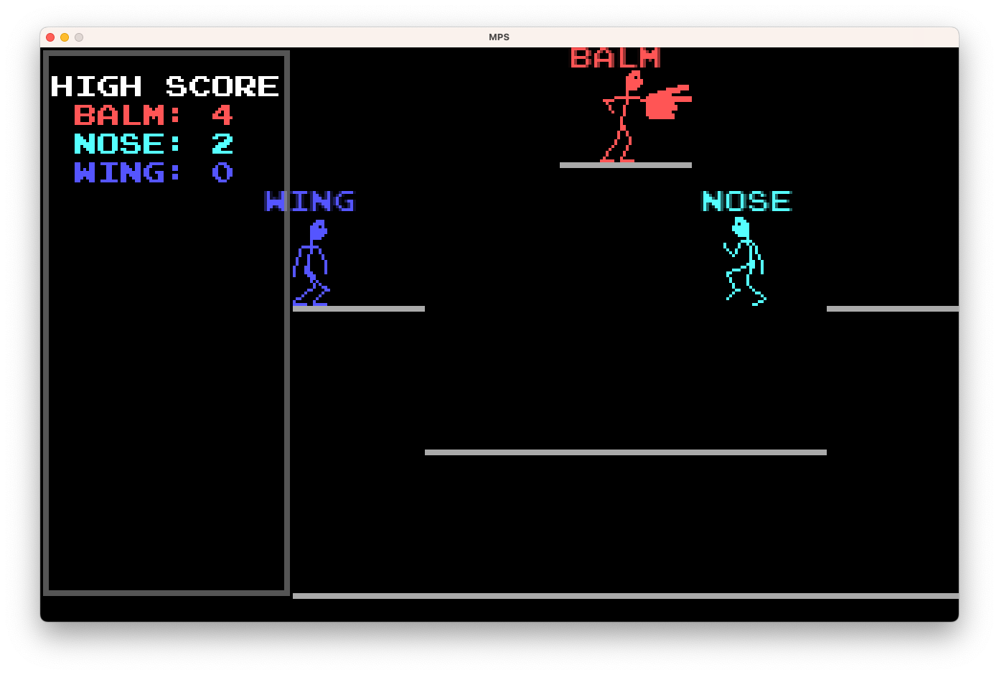

## Mosh Paper Scissors

MPS is a Massively Multiplayer Offline Rock Paper Scissors Action Game
(MMORPSAG).



## Requirements

[LÖVE](https://love2d.org) (tested with v11.3)

## Building and running

```shell
$ make
$ open mps.love
```

`make` will create a zip file called `mps.love`, meant to be played using LÖVE.

## Playing

Attack players by hitting other players with your hand in a rock, paper,
scissors move (see controls below).

If you are attacked, you can counter using the correct attack according to
classic rock, paper scissors rules. If you counter attack correctly in time,
you kill the other player, otherwise the attacker kills you.

Plug in controllers to add players. I don't know if there is a player limit, it
depends on LÖVE and your platform. I'm fairly sure it has been tested with more
than four controllers.

Last player standing wins.

### Controls

Player one uses the keyboard:
- arrow left and right: move left or right
- arrow up: jump
- A: rock
- S: paper
- X: scissors

Other players can join in by just plugging in a USB controller. In terms of an xbox controller:
- D-pad: move left or right
- A: jump
- X: rock
- Y: paper
- B: scissors

## Cool stuff that enabled me to make this game

This is from memory, it was seven years ago:

- deflemask: I maybe made one track in this
- sunvox: I made the music in this I think
- jpixel: for drawing the sprites

Libraries (you can see them in the `src/vendor` directory):

- anim8.lua
- bit.lua
- lume.lua
- lurker.lua
- sfxr.lua

## Copyright

This game is licensed under the MIT license, (see LICENSE for details).

song_0.mp3 is a cover I made of the "Janken" theme from Alex Kidd in Miracle World.  
song_1.mp3 is an adapted version of the same song.
